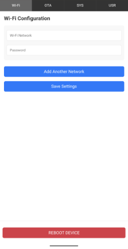
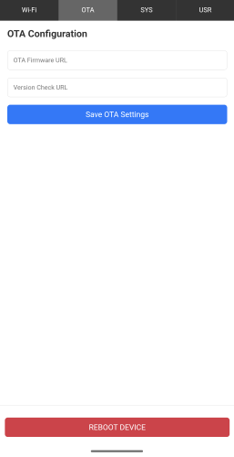
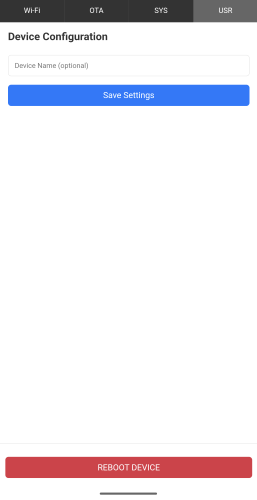

# ESP-IDF Project Template

This project is built using the **ESP-IDF framework** and provides a foundational implementation for ESP-based projects, incorporating essential functionalities such as Wi-Fi management, configuration handling, OTA updates, and version checking.

## Features

- **Wi-Fi Management**

    - Supports AP, STA, and AP+STA modes with seamless transitions.
    - AP mode includes DNS redirection.

- **Web-Based Configuration**

    - Web pages served from **SPIFFS**, allowing easy user modifications.
    - Includes OTA firmware uploading.
    - Configuration of Wi-Fi and project-specific settings.

- **Persistent Storage (NVS Manager)**

    - Handles serialization/deserialization of structured data as blobs.

- **Version Checking**

    - Queries an external host for version info via JSON.

- **Task Separation**

    - All functions are implemented in separate FreeRTOS tasks.

## Getting Started

### Prerequisites

- ESP-IDF installed ([Installation Guide](https://docs.espressif.com/projects/esp-idf/en/latest/esp32/get-started/index.html))
- Compatible ESP board (ESP32, ESP8266, etc.)

### Building & Flashing

```sh
idf.py set-target esp32  # Adjust for your board
idf.py menuconfig         # Configure project settings
idf.py flash monitor
```

## Configuration

- Use the web interface to configure Wi-Fi and project settings.
- Settings are stored in NVS for persistence.

## Contributions

Contributions are welcome! Feel free to submit PRs or report issues.

## Configuration Screenshots






## License

This project is licensed under the [Apache License 2.0](LICENSE).

